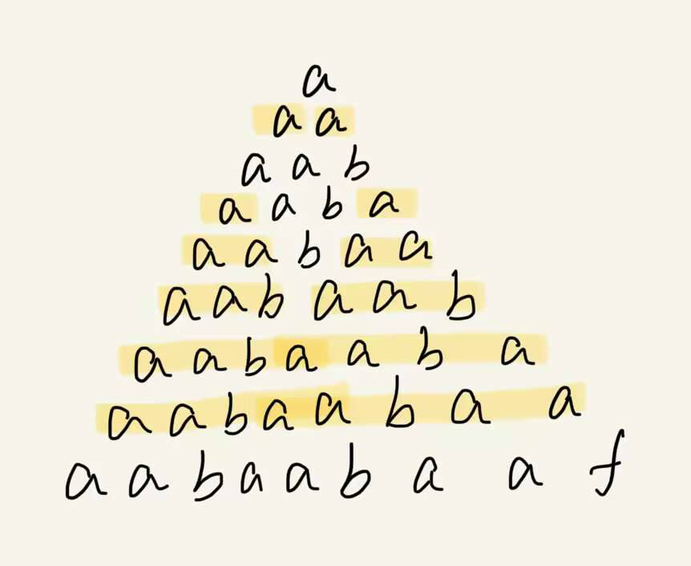
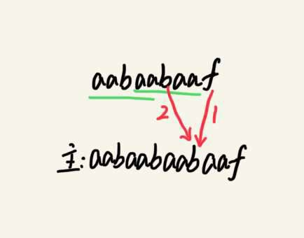

## KMP算法的算法原理和实现

在网上找了很多资料,怎么说呢,没有讲到我不理解的点上去,大多都在解释KMP算法具体过程是如何进行的,但是没有讲解清楚高效获取部分匹配表的代码逻辑,我来说说自己的看法:

本文分成两部分:
- 第一部分主要讲解KMP算法的原理
- 第二部分主要讲解KMP算法具体代码的逻辑

### KMP算法的原理

Knuth-Morris-Pratt 字符串查找算法，简称KMP 算法。可以在O(n+m) 的时间复杂度内实现两个字符串的匹配。两个字符串,一个叫**主串**,另一个叫**模式串**。

#### 主串

这是你要在其中查找子串的原始字符串。在KMP算法中，主串通常被称为文本（Text）或源字符串（Source String）。

#### 模式串

这是你要在主串中查找的子串，也就是你要匹配的字符串。在KMP算法中，模式串通常被称为模式（Pattern）或查询字符串（Query String）。

#### Brute Force

也叫穷举法。对于字符串查找，我相信很多人第一时间想到的是暴力破解，当然这种方法是是很低效的。实现逻辑是很朴素的：就是从前往后逐字符比较，一旦遇到不相同的字符，就返回False；如果两个字符串都结束了，仍然没有出现不对应的字符，则返回True。
具体代码如下：
```cpp
using namespace std;

int bruteForceSearch(const string& text, const string& pattern) {
    int textLength = text.length();
    int patternLength = pattern.length();

    for (int i = 0; i <= textLength - coutpatternLength; i++) {
        int j;

        // 逐个字符比较主串和模式串
        for (j = 0; j < patternLength; j++) {
            if (text[i + j] != pattern[j]) {
                // 如果有不匹配的字符，跳出内循环
                break;  
            }
        }

        // 如果内循环完整执行，表示找到匹配
        if (j == patternLength) {
            return i;  
        }
    }

    return -1; // 未找到匹配
}

int main() {
    string text = "This is a sample text for string matching.";
    string pattern = "sample";

    int result = bruteForceSearch(text, pattern);

    if (result != -1) {
        cout << "Pattern found at position: " << result << endl;
    } else {
        cout << "Pattern not found in the text." << endl;
    }

    return 0;
}

```

假设主串的长度是n,模式串的长度是m。那么最坏的情况就是每个位置都要进行查看是否匹配。因此时间复杂度就是 O(n*m)。

#### 部分匹配表
部分匹配表（Partial Match Table），通常缩写为PMT或Next数组，本质上是一个存储整数的数组。暴力破解的时间复杂度高，空间复杂度低，空间换时间的思想。
该表是KMP算法的核心，它也叫**失配函数**。作用是是让算法无需多次匹配S中的任何字符。能够实现线性时间搜索的关键是在主串的一些字段中检查模式串的初始字段，可以确切地知道在当前位置之前的一个潜在匹配的位置。

想要理解部分匹配表还需要理解：
- 什么是前缀
是指**不包含最后一个字符**的所有以**第一个字符开头**的连续子字符串。
- 什么是后缀
是指**不包含第一个字符**的所有以**最后一个字符结尾**的连续子字符串。
- 什么是最长公共前后缀
是指在一个字符串中，找到这个字符串的最长相等前缀和后缀的**长度**。

部分匹配表在字符串匹配算法中存储的是每个位置的最长相等前缀和后缀的长度。例如，模式串"aabaabaaf",它的部分匹配表如下：
|位置|部分匹配值|位置|部分匹配值|
|-- |   --  | -- |   --  |
|0 | 0 | 5|3|
|1|1|6|4|
|2|0|7|5|
|3|1|8|0|
|4|2|

部分匹配表中，位置0的匹配值永远是0，因为位置为0时，只有一个字符"a"，没有前缀和后缀。

上图简单解释了部分匹配值的得出。

#### 查找过程
例如,主串是"aabaabaabaaf",模式串依旧使用"aabaabaaf"

1. 开始时，主串和模式串从头开始匹配，直至遇到冲突。示例中，冲突出现在主串中的位置 "b" 处。
2. 当出现冲突时，查看模式串出现冲突的前一个位置的部分匹配值。示例中，冲突发生在主串中的位置 "b" 处，那么我们查看模式串中对应的位置 "aabaabaa**f**" 前一个位置 "aabaaba**a**f" 的部分匹配值。这个部分匹配值是5。
3. 接下来，我们从模式串中的下标为部分匹配值（即5）的位置继续匹配，同时从主串中的冲突处（位置 "b"）继续匹配。我们比较模式串中 "aabaa**b**aaf" 和主串中 "aabaabaa**b**aaf" 是否相等。如果相等，表示找到了一个匹配；如果不相等，我们重复步骤2和3。
4. 如果在部分匹配值的位置仍然没有找到匹配，那么我们继续回溯，查看模式串中的部分匹配值对应的部分匹配值，直到我们要么找到了匹配，要么回溯到模式串的起始位置（下标0）。
5. 当回溯到模式串的起始位置（下标0），而且在此之前没有找到任何匹配，这意味着在当前主串位置没有找到与模式串匹配的字符序列。在这种情况下，应该继续将主串中的匹配位置向右移动一位，并从模式串的起始位置（下标0）重新开始匹配。
这个过程会持续到找到匹配字符串或者进行到主串剩余长度小于模式串时返回没找到匹配字符串

### KMP算法具体代码的逻辑

#### 计算部分匹配表
标准的KMP算法中用于计算部分匹配表的方法:
```cpp
    void getNext(int* next, const string& s) {
        int j = 0;
        next[0] = 0;
        for(int i = 1; i < s.size(); i++) {
            while (j > 0 && s[i] != s[j]) {
                j = next[j - 1];
            }
            if (s[i] == s[j]) {
                j++;
            }
            next[i] = j;
        }
        
    }
```
我刚开始写的
```cpp
void getNextBruteForce(int* next, const string& s) {
    int length = s.size();

    for (int i = 0; i < length; i++) {
        int j = 0;
        while (j < i) {
            if (s.substr(0, j + 1) == s.substr(i - j, j + 1)) {
                j++;
            } else {
                break;
            }
        }
        next[i] = j + 1;
    }
}
```
我写的函数是进行暴力破解的方法计算部分匹配表，很拉。着重解释一下我看标准的KMP算法中用于计算部分匹配表的方法时遇见的问题
困扰我许久的就是“j = next[j - 1];”。
 
为什么是j = next[j-1]

